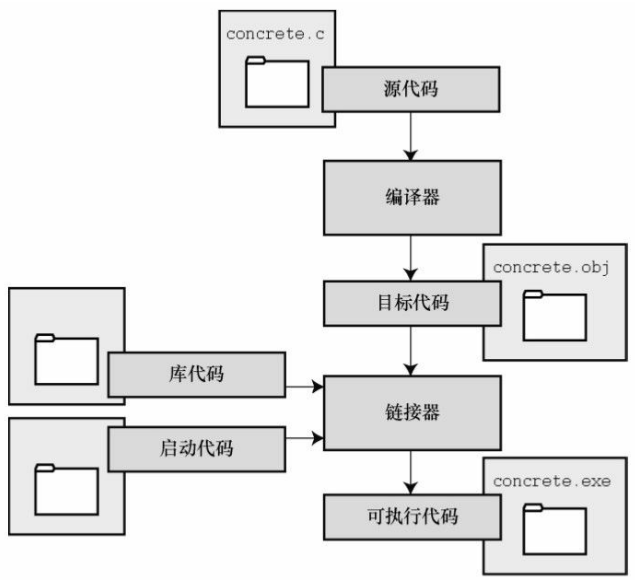

# <h1 align="center">初识C语言</h1>

- 简单历史
- 优点和缺点

- 编写程序的步骤

- 编程机制

## 1.1 C语言的起源

1972年，贝尔实验室的丹尼斯·里奇（Dennis Ritch）和肯·汤普逊（ken Thompson）开发UNIX操作系统时在B语言（作者汤普逊）的基础上设计了C语言。

## 1.2 优点和缺点

### 1.2.1 优点

- 设计特性

    融合了计算机科学理论和实践的控制特性。适用于自顶向下的规划、结构化编程和模块化设计。

- 高效

    利用了当前的计算机特性，使得C程序相对更紧凑，运行速度快。C具有汇编语言才具有的微调控制能力。

- 可移植

    C是可移植的语言。在一中系统中编写的C程序稍作修改或不修改就能在其他系统运行，极大减少了开发周期，减少了重复性的工作。

- 适用性强

    C语言能胜任很多场景。比如操作系统的开发、编程语言开发、科学计算、动画特效。

- 面向程序员

    可以利用C语言访问硬件、操控内存中的位；C语言拥有丰富的运算符，能让程序员简洁地表达自己的意图；强大的标准库，这些函数用于处理程序员常需要解决的问题。

### 1.2.2 缺点

C语言的强大带来自由的同时也带来了责任。

- 难以察觉的指针错误

    使用指针造成的错误难以察觉，需要时刻保持警惕

- 丰富的运算符和紧凑的设计可以写出令人费解的代码

## 1.3 使用C语言的7个步骤

编程并不是一个线性过程，有时需要在不同的步骤之间往复。

开发者时常会忽略开头的两步，应该先规划再动手编写代码的好习惯，用纸和笔记录下程序的目标和设计框架，这样再编写代码的过程中会更加得心应手、条理清晰。

C是编译型语言，下面是理想的C语言编程步骤。

| 步骤              | 描述                                                         | 备注                                                         |
| :---------------- | ------------------------------------------------------------ | ------------------------------------------------------------ |
| 1、定义程序目标   | 明确自己想做什么，思考程序需要哪些信息，要进行哪些计算和控制，以及程序报告的信息 |                                                              |
| 2、设计程序       | 考虑如何用程序完成任务，决定程序或辅助文件中如何表示数据以及处理数据的方式，用一般语言描述问题。 |                                                              |
| 3、编写代码       | 设计好程序后，需要把一般语言翻译成C语言，这个过程取决于编程环境。 | 应该给自己的程序添加注释                                     |
| 4、编译           | 使用编译器把源代码转换成可执行程序，转化时编译器会根据是否使用库链接一下标准库，也会报告一些警告或错误 |                                                              |
| 5、运行程序       | 根据计算机操作系统，运行程序                                 |                                                              |
| 6、测试和调试程序 | 程序可能会出现运行错误，应该检查程序是否按照设计的思路运行，程序中的错误叫做bug（行话），查找并修复程序错误的过程叫调试。 | 随着程序员能力的提升，所写的程序错误也会越来越不易察觉       |
| 7、维护和修改程序 | 创建完程序后，发现程序有错或想扩展程序的用途，就需要修改程序。 | 如果编程时清楚地做了注释和采用了合理的设计方案，维护时会更加简单。 |

## 1.4 编程机制

>注意！
>
>生成程序的具体过程因计算机环境而异。C语言是可移植性语言，生成程序的过程不尽相同。

### 1.4.1 源代码文件

用C语言编写程序时，编写的内容被存储在文本文件中，该文件被称为`源代码文件（source code file）`。大部分C系统都要求文件以`.c`结尾，例如：`budget.c`，在文件名中，`点号(.)`前面的部分称为`基本名（basename）`,点好后面的称为`扩展名（extension）`。

同时，`源代码文件`的命名应该满足计算机系统的特殊要求，比如MS-DOS中要求名字长度不超过8个字符。

### 1.4.2 目标代码文件、可执行文件、库

C编程的基本策略是，用程序把源代码文件转换成可执行文件。

编译器把源代码转换成`中间代码`，`链接器`把中间代码和其他代码合并，生成`可执行文件`。

C编译器这种分而治之的方式方便对程序进行模块化，改变了某一个模块时不需要对其他模块进行重新编译。

中间文件有多种形式。一般而言，把源代码转换成机器语言代码，并把结果存放在`目标代码文件（简称目标文件）`中，此时目标文件只包含编译器翻译的源代码，还不是一个完整的程序。

`目标代码文件`缺失`启动代码（startuo code）`。`启动代码`是程序和操作系统之间的接口。

`目标代码文件`还缺少`库函数`，几乎所有C程序都要使用C标准库中的函数。

`链接器`的作用是把程序员编写的目标代码、系统的标准启动代码和库代码这3部分合并成一个文件，这个文件叫做`可执行文件`。

### 1.4.3 实例图示

- 源代码文件concrete.c

```c
#include <stdio.h>
int main(void){
    printf("Concrete contains gravel and cement.\n");
    return 0;
}
```

- 编译过程


